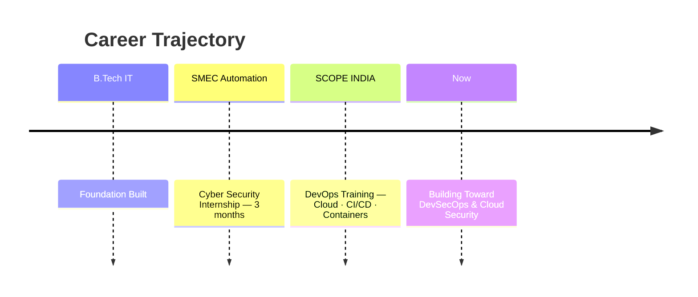

```mermaid
flowchart LR
    A[👨‍💻 GitHub] -->|push| B[⚙️ Jenkins Build]
    B -->|image| C[🐳 Docker]
    C -->|push| D[📦 Docker Hub]
    D -->|pull| E[☸️ Kubernetes]
    E -->|deploy| F[☁️ Amazon EKS]
    F -->|hardened by| G[🛡️ DevSecOps]

    style A fill:#181717,stroke:#00F0FF,color:#fff
    style B fill:#D24939,stroke:#00F0FF,color:#fff
    style C fill:#2496ED,stroke:#00F0FF,color:#fff
    style D fill:#2496ED,stroke:#00F0FF,color:#fff
    style E fill:#326CE5,stroke:#00F0FF,color:#fff
    style F fill:#FF9900,stroke:#00F0FF,color:#fff
    style G fill:#7C3AED,stroke:#00F0FF,color:#fff
```

<div align="center">


<br>

```ansi
[0;36m┌──────────────────────────────────────────────────────────────────┐
│[0m [1;35mROLE[0m      : Software Engineer // DevOps // Cloud // CyberSec      [0;36m│
│[0m [1;35mSTATUS[0m    : ONLINE — Learning & Building                          [0;36m│
│[0m [1;35mUPTIME[0m    : Always Shipping                                       [0;36m│
└──────────────────────────────────────────────────────────────────┘[0m
```

<a href="https://github.com/Saf1111"></a>
<a href="https://www.linkedin.com/in/safwan-s-a04993317/"></a>
<a href="mailto:safsafu786@gmail.com"></a>


</div>

<br>


<br>

<div align="center">

## `<// ABOUT_ME >`

</div>

```yaml
identity:
  education: "B.Tech — Information Technology"
  role: "Software Engineer"
  training: "DevOps Training @ SCOPE INDIA"
  internship: "Cyber Security — SMEC Automation (3 months)"

philosophy: >
  Learn by building. Deploy real systems, break things,
  automate the fix, and secure what ships.
  Theory is the map — production is the territory.

current_focus: ["DevSecOps", "AWS", "Cloud Security"]
```

<br>


<br>

<div align="center">

## `<// TECH_STACK >`

<br>


<br><br>

| MODULE | POWER LEVEL |
|:--|:--|
| ☁️ **AWS** | `████████████████░░░░` 80% |
| 🐳 **Docker** | `██████████████████░░` 90% |
| ☸️ **Kubernetes** | `███████████████░░░░░` 75% |
| 🔧 **Jenkins** | `████████████████░░░░` 80% |
| 🏗️ **Terraform** | `█████████████░░░░░░░` 65% |
| 🤖 **Ansible** | `█████████████░░░░░░░` 65% |
| 🐧 **Linux** | `██████████████████░░` 90% |
| 🐍 **Python** | `███████████████░░░░░` 75% |

</div>

<br>


<br>

<div align="center">

## `<// CI_CD_PIPELINE.exe >`

</div>



<br>


<br>

<div align="center">

## `<// PROJECTS.db >`

<br>

<table>
<tr><th align="left">PROJECT</th><th align="left">TYPE</th><th align="left">STACK</th><th align="left">LINK</th></tr>

<tr>
<td>🍔 <b>Quick-Bite</b></td>
<td>End-to-End DevOps Deployment</td>
<td>   </td>
<td><a href="https://github.com/Saf1111/Quick-Bite-DeliveryApp"></a></td>
</tr>

<tr>
<td>🔧 <b>Jenkins Shared Library</b></td>
<td>CI/CD Automation</td>
<td> </td>
<td><a href="https://github.com/Saf1111/my_shared_library"></a></td>
</tr>

<tr>
<td>☕ <b>Maven Web App</b></td>
<td>DevOps Deployment Practice</td>
<td>   </td>
<td><a href="https://github.com/Saf1111/maven-web-app"></a></td>
</tr>

<tr>
<td>🩸 <b>SYS Blood Bank</b></td>
<td>Web Application</td>
<td> </td>
<td><a href="https://github.com/Saf1111/SYS-Blood-Bank"></a></td>
</tr>

</table>

<br>

<a href="https://github.com/Saf1111/QEMS-Website"></a>
<a href="https://github.com/Saf1111/Devops-Project"></a>
<a href="https://github.com/Saf1111/naan-mudhalvan-project"></a>

</div>

<br>


<br>

<div align="center">

## `<// EXPERIENCE_LOG >`

</div>



<br>


<br>

<div align="center">

## `<// LEARNING_QUEUE >`

<br>


<br><br>


<br>


</div>

<br>


<br>

<div align="center">

## `<// ANALYTICS.dashboard >`

<br>


<br><br>


<br><br>


</div>

<br>


<br>

<div align="center">

## `<// LANG_PACKS >`

```yaml
languages:
  malayalam: fluent        # 🇮🇳
  english:   fluent        # 🇬🇧
  hindi:     conversational # 🇮🇳
  tamil:     basic          # 🇮🇳
  arabic:    beginner       # 🇸🇦
  urdu:      beginner       # 🟢
```

</div>

<br>


<br>

<div align="center">

## `<// ROADMAP.exe >`

<br>

 ➜
 ➜
 ➜


<br><br>

> `while(alive) { learn(); build(); automate(); secure(); improve(); }`

</div>

<br>


<br>

<div align="center">

## `<// CONNECT.sh >`

<a href="https://github.com/Saf1111"></a>
<a href="https://www.linkedin.com/in/safwan-s-a04993317/"></a>
<a href="mailto:safsafu786@gmail.com"></a>

<br><br>

### `> Software Engineer :: DevOps Learner :: Cloud & Security Enthusiast_`

</div>

<br>

<div align="center">


</div>
